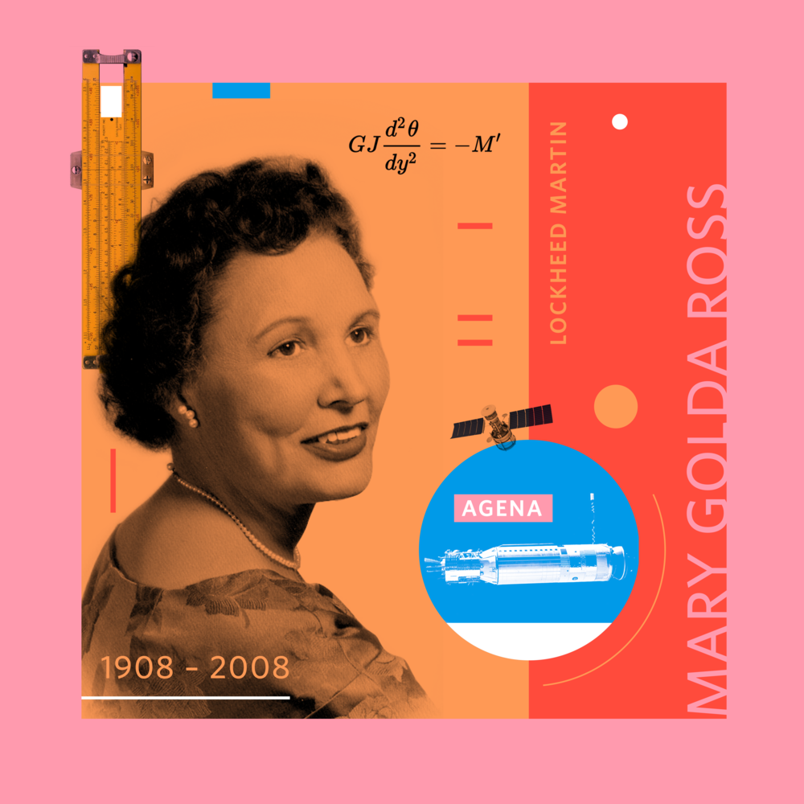

-------

[home](https://mlops.archi/)  \| [about](https://mlops.archi/about.html) 

-------

# Mary Golda Ross, an Original Native In STEM

### By <a href="https://mlops.archi/about.html" target="_blank" rel="noopener noreferrer">Disesdi Susanna</a> | 01 November 2023

-------

*Image [source](https://www.beyondcurie.com/mary-golda-ross)*[1]

Did you know that the only female founding member of Lockheed's elite Skunkworks engineering team was also Cherokee?

Mary Golda Ross was the first female Native American engineer, the first female engineer at Lockheed, a founding member of the Society of Women Engineers, and many more firsts. Her work helped launch the US into the space age. 

She is [recognized by NASA as a “hidden figure”](https://www.nasa.gov/image-article/mary-ross-hidden-figure/)[2] in aerospace and mathematics for her work ranging from [saving the design for then-cutting edge P-38 Lightning fighter plane](https://www.nationalww2museum.org/war/articles/mary-golda-ross-and-skunk-works),[3]
 to helping author [the NASA Planetary Flight Handbook Vol. III](https://ntrs.nasa.gov/citations/19700019224).[4]

She [credited her Native culture](https://airandspace.si.edu/stories/editorial/mary-g-ross-aerospace-engineer) as a foundation for her work on some of the most important top-secret technologies of the Cold War. Her life stands as a powerful testament to the fact that Native women belong in STEM.

If you feel like you don't belong (which, as a Native in STEM, I know I sometimes do) remember Mary Golda Ross. When she was both the only woman and the only Native in the room, she didn't run from the challenge--she let the innovation & elegance of her work shine through.

When talking about her education, Mary [recounted](https://www.cherokeephoenix.org/culture/cherokee-rocket-scientist-leaves-heavenly-gift/article_e419c6ec-af3c-54cd-a8a9-6ed273d0d849.html) being an outsider in academia: “When I went to the college to enroll, they asked me what I wanted for my major subject. I said, ‘What’s a major subject?'"[5] Her major would turn out to be mathematics--and the rest is history.

When she walked on in 2008, just three months shy of her 100th birthday, Mary left a $400,000 endowment to the Smithsonian’s National Museum of the American Indian.

The Cherokee Phoenix [covered her generous act](https://www.cherokeephoenix.org/culture/cherokee-rocket-scientist-leaves-heavenly-gift/article_e419c6ec-af3c-54cd-a8a9-6ed273d0d849.html) with the headline: "*Cherokee rocket scientist leaves heavenly gift*".

Happy Native American Heritage Month!

#NativeAmericanHeritageMonth #NativesInSTEM #NativesInTech #NAHM

-------

### [Contact me >>](https://mlops.archi/about.html)

-------

## References

1. “Mary Golda Ross — Beyond Curie—a design project celebrating women in STEM.” n.d. Beyond Curie. Accessed November 1, 2023. https://www.beyondcurie.com/mary-golda-ross.

2. “Mary Ross: A Hidden Figure.” 2018. NASA. https://www.nasa.gov/image-article/mary-ross-hidden-figure/.

3. “Mary Golda Ross and the Skunk Works.” 2021. The National WWII Museum. https://www.nationalww2museum.org/war/articles/mary-golda-ross-and-skunk-works.

4. “Space flight handbooks. Volume 3 - Planetary flight handbook. Part 9 - Direct and Venus swingby trajectories to Mercury.” n.d. NASA Technical Reports Server. Accessed November 1, 2023. https://ntrs.nasa.gov/citations/19700019224.

5. Briggs, Kara. 2008. “Cherokee rocket scientist leaves heavenly gift." Cherokee Phoenix. https://www.cherokeephoenix.org/culture/cherokee-rocket-scientist-leaves-heavenly-gift/article_e419c6ec-af3c-54cd-a8a9-6ed273d0d849.html.

-------

[home](https://mlops.archi/)  \| [about](https://mlops.archi/about.html) 
